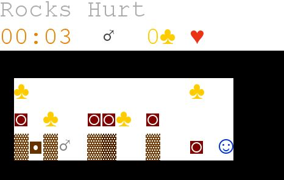

# Gold Digger 
Tribute: https://golddigger.frvr.com/

## Gallery

### Main Menu
<p align="center">
  
</p>

### Selector
<p align="center">
  
</p>

### A level
<p align="center">
  
</p>

### Game Won
<p align="center">
  
</p>

### Game Over
<p align="center">
  
</p>

### All Completed
<p align="center">
  
</p>

### Flood Fill
<p align="center">
  
</p>


## Development
[Documentation](docs)

### Technologies 
* Java
* Lanterna

## How to Run
### Install dependencies and compile assets
```
./gradlew build
```

### Run
```
./gradlew run
```

**Disclaimer** - This repository was created for educational purposes and we do not take any responsibility for anything related to its content. You are free to use any code or algorithm you find, but do so at your own risk.

